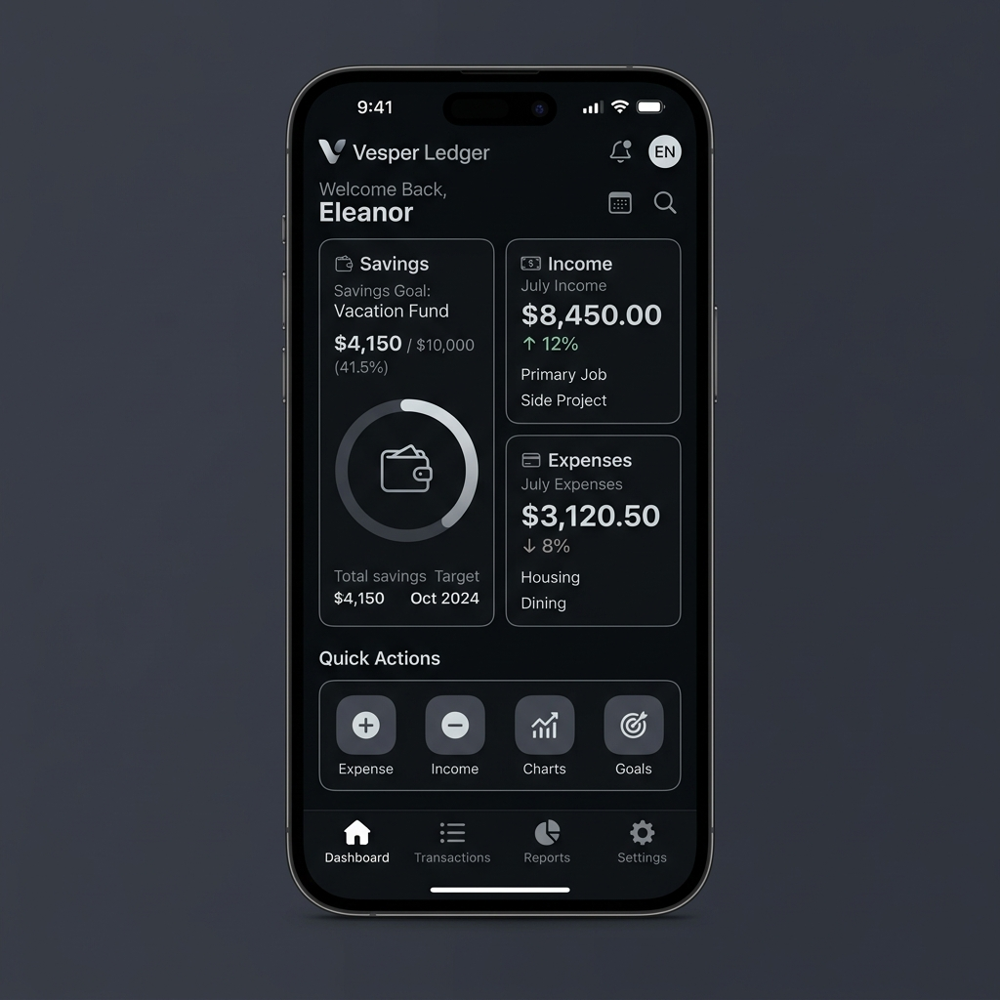

# Vesper Ledger — Expense Tracker & Money Management

Vesper Ledger is a premium, minimalist personal finance tracker designed for Android using Jetpack Compose. It strictly adheres to a **shadcn-inspired mobile design language**—relying on high typographic contrast, thin clean borders, flat components, and a quiet, monochrome-centric color palette.

The main purpose of the app is to help users quickly add income and expenses, track savings, manage spending habits, and maintain awareness of their money without overwhelming them with unnecessary analytics dashboards, motivational scores, or promotional widgets.

## Visual Design & Preview
 
### App Icon
The app icon represents a minimalist, flat design with a high-contrast geometric representation of a balance scale and a line chart combined in a stylized "V".
 

 
### Dashboard Preview
The Dashboard layout utilizes Bento-grid styling to group information into clean, high-contrast flat cards.
 


### Onboarding Screens Preview
The onboarding flow introduces the core narrative with premium character illustrations. The outlines, cards, and environment tags automatically adapt to the active system theme (Light vs. Dark Mode) for a seamless, glare-free visual experience.


## Key Features

- **Distraction-Free Bento Overview:** Fast, clean dashboard showing Available Balance, Income, Expenses, and Savings totals at a glance.
- **Grouped Transaction Log:** Easy-to-read chronological list grouped by calendar dates, equipped with filter chips and live keyword searching.
- **Add Transactions Instantly:** Large typography-centric amount panel matching Space Grotesk layout, with dynamic category filtering.
- **Savings Goals Tracker:** Set targets, deposit/withdraw money, and see progress via flat linear loaders.
- **Custom Category Builder:** Create custom categories with custom icons and distinct theme colors in Settings.
- **Dynamic System Themes:** Fully supports system dark, light, and automatic theme configurations with instant preferences reloading.
- **100% Offline Privacy:** Powered by Room SQLite Database. No account creation, cloud syncs, or trackers.

---

## Design System

Vesper Ledger implements a strict custom design system built on top of Jetpack Compose Material 3:
- **8dp Grid:** All spacing, margins, padding, and alignments are strict multiples of `8dp` (or `4dp` micro-spacings).
- **Shadcn Color Palette:** Slate-based background neutral colors with semantic accent indicators:
  - **Income:** `#16A34A` (Green)
  - **Expenses:** `#DC2626` (Red)
  - **Savings:** `#2563EB` (Blue)
- **Typography:**
  - **Space Grotesk** for display amounts, large numbers, and headings.
  - **Plus Jakarta Sans** for labels, navigation controls, inputs, and descriptions.
- **Elevations & Borders:** Flat design styling. Interactive cards leverage a `1dp` slate border stroke instead of heavy shadows or complex gradients.

---

## Tech Stack & Architecture

- **Jetpack Compose:** Fully declarative UI using modern Compose components.
- **Room Database:** Local SQLite persistence with custom `TransactionType` converters and asynchronous pre-population triggers.
- **MVVM Architecture:** Clean separation of concerns with reactive StateFlow flows and custom ViewModel Factories.
- **AndroidX Navigation:** Type-safe screen navigation.

---

## Building and Releasing

The project includes a pre-configured GitHub Actions workflow in `.github/workflows/release.yml`. When you push a version tag (e.g. `v1.0.0`), the pipeline automatically builds a **normal release APK** and publishes it as a GitHub Release on the main page of your repository.

### Manual Local Build
To assemble a release build locally:
```bash
gradle assembleRelease
```
The output APK will be generated at:
`app/build/outputs/apk/release/app-release-unsigned.apk`
